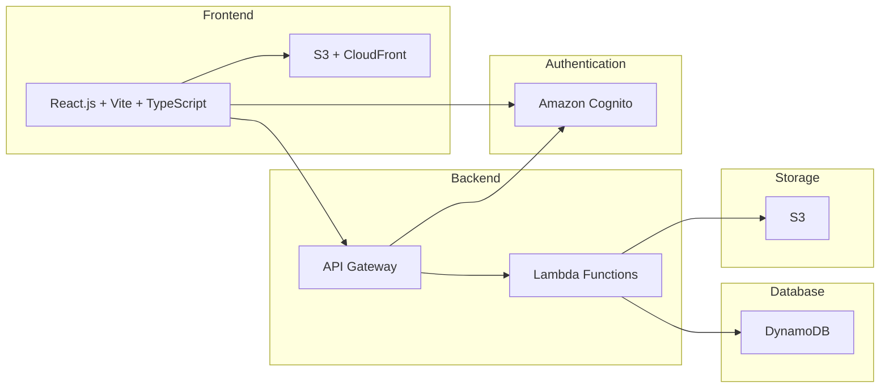

# ChaosFiles

ChaosFiles is a scalable and secure file sharing platform built using modern web technologies and AWS services. It allows users to easily upload, manage, and share files with others.

## Features

- User authentication with Google Sign-In via AWS Cognito
- Secure file upload and download with pre-signed URLs
- Support for large file uploads using multipart upload
- File metadata storage in DynamoDB
- Scalable file storage using Amazon S3
- Serverless backend using AWS Lambda and API Gateway
- React-based responsive frontend

## Architecture

The ChaosFiles architecture leverages several AWS services to provide a scalable and robust file sharing solution:

- Amazon Cognito for user authentication and authorization
- Amazon S3 for file storage
- Amazon DynamoDB for storing file metadata
- AWS Lambda for serverless backend processing
- Amazon API Gateway for RESTful APIs
- Amazon CloudFront for content delivery

## Architecture Diagram

## Getting Started

To use ChaosFiles, simply visit our website at [https://d358wcpg4x8g95.cloudfront.net](https://d358wcpg4x8g95.cloudfront.net).

## License

This project is licensed under the [MIT License](LICENSE).
